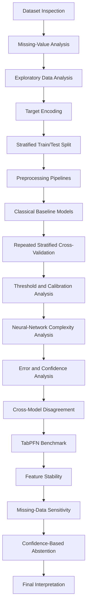

# Breast Tumor Classification: Model Performance, Validation and Robustness

A machine-learning study of breast tumor classification using the Wisconsin Breast Cancer Original dataset, focusing on model evaluation, validation, probability calibration, feature stability, error analysis, and prediction uncertainty.

**Project focus:** Investigating how evaluation methodology affects the apparent reliability of machine-learning models for breast-tumor classification.

---

## Research Question

**How does evaluation methodology affect the apparent reliability of machine-learning models for breast-tumor classification?**

Rather than relying on a single accuracy value, the study evaluates models across multiple metrics, validation procedures, probability behavior, difficult cases, feature stability, missing-data treatments, and confidence thresholds.

## Research Questions

1. How consistently do classical machine-learning models perform under repeated stratified validation?
2. Does increasing neural-network complexity produce meaningful improvement on a small tabular dataset?
3. How do classification thresholds affect sensitivity and specificity?
4. How well calibrated are model probabilities?
5. Are difficult cases consistently misclassified across different model families?
6. Are feature-importance estimates stable across validation folds?
7. How sensitive are results to missing-value treatment?
8. Can confidence-based abstention improve accuracy among retained predictions?
9. How does TabPFN compare with conventional approaches on this dataset?

---

## Dataset

The primary dataset is the **Wisconsin Breast Cancer Original (WBC)** dataset from the UCI Machine Learning Repository.

| Property               |         Value |
| ---------------------- | ------------: |
| Observations           |           699 |
| Features               |             9 |
| Benign observations    |           458 |
| Malignant observations |           241 |
| Feature scale          |          1–10 |
| Missing values         |            16 |
| Missing-value feature  | `Bare_nuclei` |

Original target labels:

* `2` — benign
* `4` — malignant

For modeling:

* `0` — benign
* `1` — malignant

The dataset contains nine integer-valued features describing characteristics of cell nuclei from breast-tumor samples.

The UCI documentation describes chronological collection groups, but the corresponding group labels are not included in the returned feature table. Therefore, this study does **not** reconstruct or assume chronological ordering.

The dataset is retrieved programmatically using `ucimlrepo` rather than redistributed through this repository.

See [`DATASET.md`](DATASET.md) for dataset documentation and citation information.

---

## Methodology

The analysis follows this workflow:



### Preprocessing

Missing values are handled using **median imputation fitted within the modeling pipeline**.

Scaled models additionally use standardization. Tree-based models use imputation without feature scaling.

Keeping preprocessing inside the pipeline prevents information from the evaluation data from being used during preprocessing.

---

## Models

### Classical Models

* Logistic Regression
* Support Vector Machine (SVM)
* Decision Tree
* Random Forest

### Neural Networks

Three MLP architectures were evaluated:

| Architecture          | Hidden Layers |
| --------------------- | ------------- |
| MLP - 1 Hidden Layer  | `(32,)`       |
| MLP - 2 Hidden Layers | `(32, 16)`    |
| MLP - 3 Hidden Layers | `(32, 16, 8)` |

The MLP experiments use ReLU activation, Adam optimization, early stopping, standardized features, and median imputation.

The purpose of this experiment is to examine whether increasing neural-network complexity provides meaningful improvement on a small tabular dataset.

### Tabular Benchmark

**TabPFN** was included as an additional benchmark for comparison with conventional approaches.

It is treated as a benchmark rather than evidence that one model is universally preferable.

---

## Evaluation

Models were evaluated using complementary measures.

### Classification

* Accuracy
* Precision
* Sensitivity / Recall
* Specificity
* F1-score
* Matthews Correlation Coefficient (MCC)

### Ranking

* ROC-AUC
* PR-AUC

### Probability Quality

* Brier score
* Calibration curves

Additional analyses examined classification thresholds, feature stability, missing-data sensitivity, prediction disagreement, difficult cases, and confidence-based abstention.

---

## Validation Strategy

A stratified 80/20 train-test split was used for the primary hold-out analysis.

The training data was also evaluated using **5-fold stratified cross-validation with 5 repeats**.

This allowed performance variability to be examined across multiple validation folds and repetitions rather than relying on a single split.

---

# Key Findings

## 1. Classical Model Performance

Repeated stratified 5-fold cross-validation with 5 repeats produced:

| Model               |      Accuracy |   Sensitivity |       ROC-AUC |           MCC |
| ------------------- | ------------: | ------------: | ------------: | ------------: |
| Logistic Regression | 0.967 ± 0.010 | 0.951 ± 0.027 | 0.995 ± 0.003 | 0.928 ± 0.022 |
| SVM                 | 0.967 ± 0.009 | 0.971 ± 0.017 | 0.990 ± 0.006 | 0.928 ± 0.018 |
| Decision Tree       | 0.936 ± 0.018 | 0.889 ± 0.051 | 0.924 ± 0.024 | 0.858 ± 0.040 |
| Random Forest       | 0.968 ± 0.010 | 0.963 ± 0.022 | 0.992 ± 0.004 | 0.929 ± 0.022 |

The models showed different behavior across metrics, illustrating why model evaluation should not rely on accuracy alone.

---

## 2. Neural-Network Complexity

| Architecture    |      Accuracy |   Sensitivity |       ROC-AUC |           MCC |
| --------------- | ------------: | ------------: | ------------: | ------------: |
| 1 hidden layer  | 0.966 ± 0.014 | 0.973 ± 0.027 | 0.992 ± 0.005 | 0.926 ± 0.031 |
| 2 hidden layers | 0.962 ± 0.018 | 0.947 ± 0.055 | 0.994 ± 0.003 | 0.917 ± 0.041 |
| 3 hidden layers | 0.962 ± 0.022 | 0.945 ± 0.057 | 0.994 ± 0.004 | 0.916 ± 0.049 |

Increasing the number of hidden layers did **not** produce a consistent improvement in overall performance.

---

## 3. Probability Calibration

Hold-out Brier scores were:

| Model                 | Brier Score |
| --------------------- | ----------: |
| Logistic Regression   |      0.0327 |
| SVM                   |      0.0333 |
| Decision Tree         |      0.0714 |
| Random Forest         |      0.0363 |
| MLP — 1 hidden layer  |      0.0796 |
| MLP — 2 hidden layers |      0.0306 |
| MLP — 3 hidden layers |      0.0321 |

Classification performance and probability reliability were examined separately because a model can classify well while producing probabilities with different calibration characteristics.

---

## 4. Difficult Cases and Error Analysis

Four test observations were misclassified by all seven evaluated models:

* Logistic Regression
* SVM
* Decision Tree
* Random Forest
* MLP with 1 hidden layer
* MLP with 2 hidden layers
* MLP with 3 hidden layers

Cross-model error overlap was used to identify observations that were consistently difficult for multiple approaches.

These cases represent **algorithmic classification difficulty within the evaluated feature space** and should not be interpreted as clinical ambiguity.

---

## 5. Prediction Disagreement and Uncertainty

Cross-model disagreement was examined using:

* Malignant votes
* Benign votes
* Prediction disagreement
* Majority prediction
* Majority-prediction correctness

Some observations produced substantial disagreement between models.

The analysis also showed that incorrect predictions could sometimes have high confidence, indicating that confidence alone should not automatically be interpreted as correctness.

---

## 6. Feature Stability

Random Forest permutation importance was evaluated across five validation folds using 20 permutation repeats per fold and ROC-AUC scoring.

`Bare_nuclei` showed relatively consistent positive permutation importance across folds, while several other features showed smaller or more variable effects.

Because the features are correlated, permutation importance is treated as a model- and data-dependent analysis rather than a definitive measure of biological importance.

---

## 7. Missing-Data Sensitivity

The primary analysis uses median imputation.

A complete-case sensitivity analysis was also performed for Logistic Regression:

| Metric      | Complete-case result |
| ----------- | -------------------: |
| Accuracy    |               ~0.969 |
| Precision   |               ~0.954 |
| Sensitivity |               ~0.958 |
| F1          |               ~0.955 |
| ROC-AUC     |               ~0.996 |
| PR-AUC      |               ~0.992 |
| MCC         |               ~0.932 |

The overall performance pattern was similar to the median-imputation analysis within this experiment.

---

## 8. Confidence-Based Abstention

For the 2-hidden-layer MLP:

| Confidence Threshold | Coverage | Abstention Rate | Accepted Accuracy |
| -------------------: | -------: | --------------: | ----------------: |
|                 0.50 |  100.00% |           0.00% |            95.71% |
|                 0.60 |   99.29% |           0.71% |            95.68% |
|                 0.70 |   97.86% |           2.14% |            96.35% |
|                 0.80 |   95.00% |           5.00% |            98.50% |
|                 0.90 |   93.57% |           6.43% |            98.47% |
|                 0.95 |   88.57% |          11.43% |            99.19% |

Higher confidence thresholds reduced coverage while increasing accuracy among retained predictions.

The **99.19% value is accepted-case accuracy, not overall model accuracy**. This analysis is exploratory and uses the held-out test set.

---

## 9. TabPFN Benchmark

### Hold-out Evaluation

| Metric      | Result |
| ----------- | -----: |
| Accuracy    |  0.964 |
| Precision   |  0.939 |
| Sensitivity |  0.958 |
| Specificity |  0.967 |
| F1          |  0.948 |
| ROC-AUC     |  0.994 |
| PR-AUC      |  0.990 |
| MCC         |  0.921 |

### 5-Fold Cross-Validation

| Metric      |     Mean ± SD |
| ----------- | ------------: |
| Accuracy    | 0.973 ± 0.011 |
| Precision   | 0.941 ± 0.024 |
| Sensitivity | 0.985 ± 0.013 |
| F1          | 0.962 ± 0.015 |
| ROC-AUC     | 0.994 ± 0.004 |
| PR-AUC      | 0.988 ± 0.009 |
| MCC         | 0.942 ± 0.024 |

TabPFN provides an additional reference point for the classification task and is included as a benchmark rather than as evidence of universal model superiority.

---

# What This Study Shows

The experiments show that model performance cannot be adequately characterized by a single accuracy estimate.

The analysis considered:

* Repeated validation performance
* Sensitivity and specificity
* Probability calibration
* Classification thresholds
* Cross-model error consistency
* Prediction disagreement
* Feature-importance stability
* Missing-data sensitivity
* Confidence-based coverage
* Model complexity

The neural-network experiments also show that increasing architectural depth does not necessarily improve performance on a small structured dataset.

Overall, the project emphasizes **evaluation and interpretation rather than model selection based on a single metric**.

---

# Limitations

* The dataset contains only 699 observations.
* Missing values are present in `Bare_nuclei`.
* Original chronological group labels are unavailable in the returned feature table, so direct chronological evaluation was not performed.
* The held-out test set contains 140 observations, creating uncertainty around individual test-set estimates.
* Several exploratory analyses use the same held-out test set and should not be interpreted as independent external validation.
* Permutation importance is model- and data-dependent, particularly with correlated features.
* Difficult cases represent algorithmic classification difficulty and should not be interpreted as clinical ambiguity.
* The study uses structured tabular data rather than raw medical images.
* The dataset and experiments do not establish clinical readiness, diagnostic utility, or deployment suitability.
* Performance on this historical benchmark should not be interpreted as evidence of real-world clinical performance.

---

# Project Structure

```text
breast-tumor-classification/
├── notebooks/
│   └── 01_dataset_understanding.ipynb
├── src/
│   ├── preprocessing.py
│   ├── models.py
│   ├── evaluation.py
│   └── analysis.py
├── tests/
│   ├── test_preprocessing.py
│   ├── test_models.py
│   └── test_evaluation.py
├── .gitignore
├── DATASET.md
├── README.md
└── requirements.txt
```

### Source Modules

**`src/preprocessing.py`**

Target encoding, data splitting, and preprocessing utilities.

**`src/models.py`**

Reusable baseline model pipelines and MLP construction.

**`src/evaluation.py`**

Classification metrics, specificity, Brier score, and threshold analysis.

**`src/analysis.py`**

Feature importance, feature stability, prediction disagreement, and confidence-based abstention utilities.

### Tests

Automated tests using `pytest` cover:

* Target encoding
* Model construction
* Pipeline interfaces
* Specificity calculation
* Evaluation metrics

---

# Reproducibility

## Run the Tests

```bash
python -m pytest
```

## Run the Notebook

Open:

```text
notebooks/01_dataset_understanding.ipynb
```

and run it using Jupyter or VS Code.

The dataset is retrieved programmatically from the UCI Machine Learning Repository through `ucimlrepo`.

### TabPFN Note

The TabPFN benchmark requires its package and external authentication/license setup.

The API key is **not stored in this repository**. The notebook requests the credential through an environment variable or secure input when the TabPFN section is executed.

Never commit the credential to Git or place it directly inside the notebook.

---

# Technical Stack

### Programming

* Python

### Data Science

* NumPy
* Pandas
* SciPy
* Statsmodels

### Machine Learning

* Scikit-learn
* Logistic Regression
* Support Vector Machines
* Decision Trees
* Random Forest
* Multi-Layer Perceptron
* TabPFN

### Evaluation & Analysis

* Cross-validation
* Classification metrics
* ROC-AUC
* PR-AUC
* Calibration
* Brier score
* Threshold analysis
* Permutation importance
* Feature stability
* Error analysis
* Prediction disagreement
* Confidence analysis
* Abstention analysis
* Missing-data sensitivity

### Visualization

* Matplotlib
* Seaborn

### Development

* Jupyter
* VS Code
* pytest
* Git
* GitHub

---

# Dataset Source

**Breast Cancer Wisconsin (Original)**

UCI Machine Learning Repository

Dataset ID: 15

The dataset is accessed programmatically using the `ucimlrepo` package.

See [`DATASET.md`](DATASET.md) for dataset-specific documentation and citation information.

---

# Ethical and Scope Disclaimer

This project is an educational and research-oriented machine-learning study using a publicly available historical dataset.

It is **not a clinical diagnostic system** and has not been validated for medical deployment.

The reported results describe model behavior on the dataset and evaluation procedures used in this study. They should not be interpreted as medical advice, clinical performance, or evidence that the models are suitable for use with patients.

---

# Author

**Gayatri Praharshitha**

---

# Project Status

**Status:** Research analysis and portfolio implementation complete.

The repository contains:

* Dataset analysis
* Classical ML baselines
* Repeated cross-validation
* Neural-network complexity analysis
* Probability calibration
* Error and uncertainty analysis
* TabPFN benchmarking
* Feature stability analysis
* Missing-data sensitivity analysis
* Confidence-based abstention
* Reusable source modules
* Automated tests
* Reproducibility documentation
